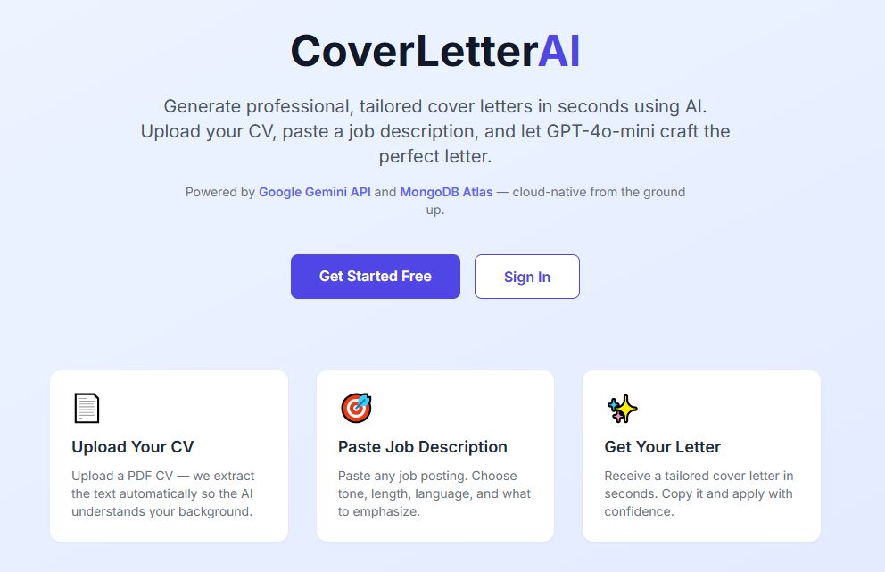
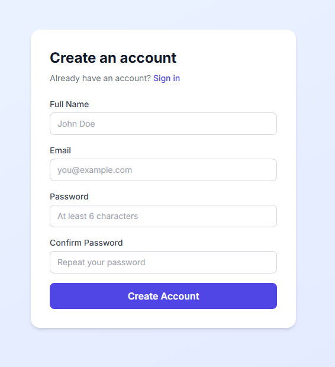
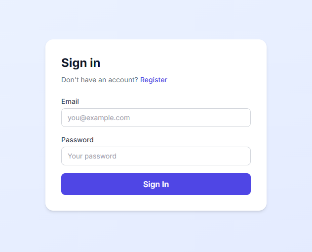
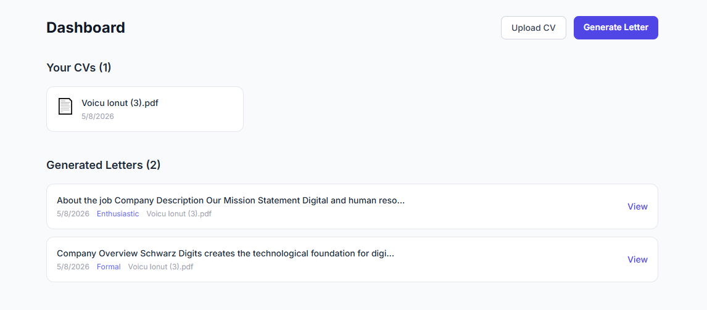
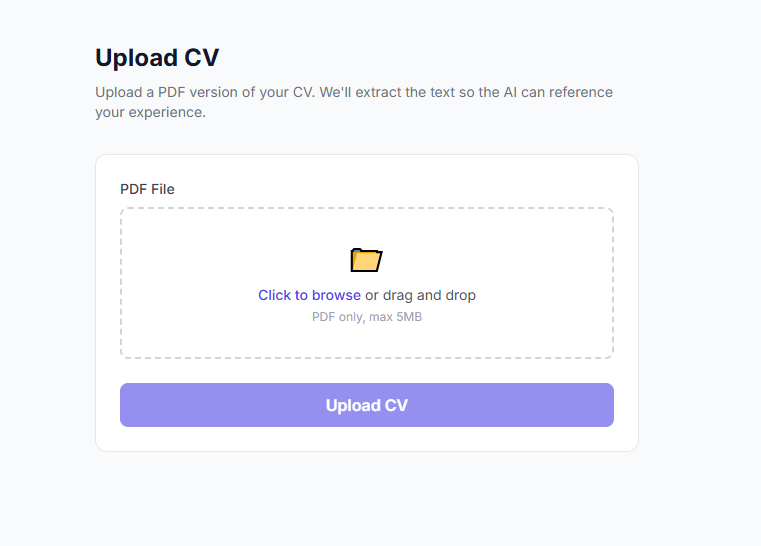
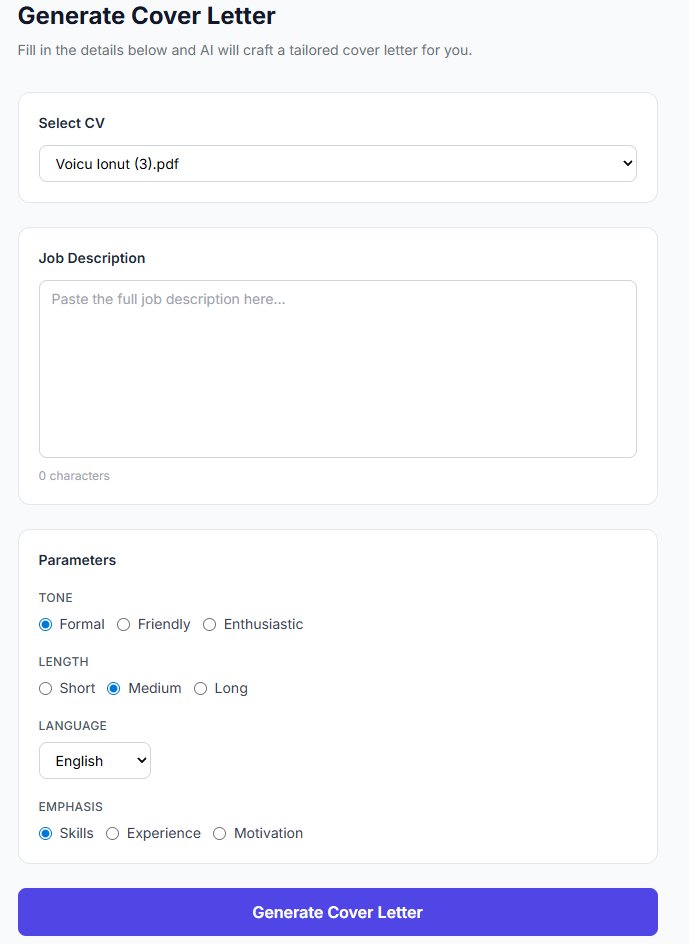
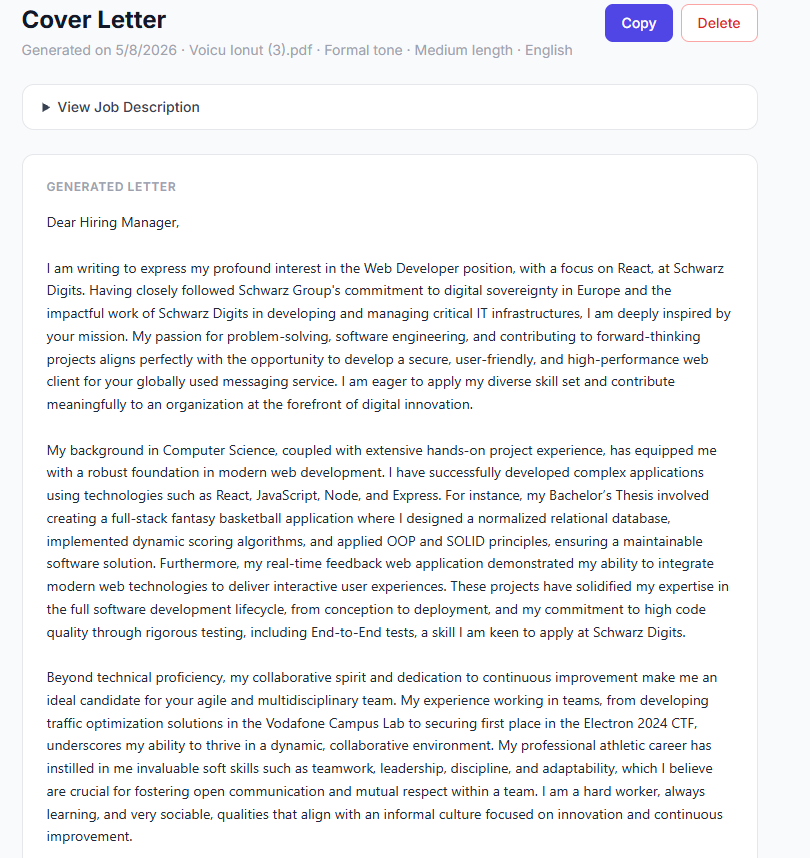

## 1. Introducere

CoverLetterAI este o aplicație web full-stack care permite utilizatorilor să genereze scrisori de intenție personalizate folosind inteligență artificială. Utilizatorul își creează un cont, încarcă CV-ul în format PDF, introduce descrierea unui loc de muncă și configurează parametri precum tonul, lungimea, limba și accentul dorit. Aplicația procesează aceste date și apelează API-ul Google Gemini pentru a genera o scrisoare de intenție profesională, adaptată profilului candidatului și cerințelor jobului.

**Tech stack:**
- **Frontend & Backend:** Next.js 14 (App Router, TypeScript)
- **Bază de date:** MongoDB Atlas (cloud NoSQL)
- **Autentificare:** NextAuth.js v4 (Credentials Provider + JWT)
- **AI:** Google Gemini 2.5 Flash via Google AI Studio REST API
- **Parsare PDF:** pdf-parse (server-side)
- **Deployment:** AWS EC2 + Docker

**Cum rulezi local:**

```bash
git clone <repo-url>
cd cover-letter-app
npm install
```

Completează `.env.local`:

```env
MONGODB_URI=mongodb+srv://<user>:<password>@cluster0.xxxxx.mongodb.net/cover-letter-app
GOOGLE_AI_API_KEY=AIza...
NEXTAUTH_SECRET=some-random-secret-string
NEXTAUTH_URL=http://localhost:3000
```

```bash
npm run dev
```

---

## 2. Descriere problemă

Procesul de căutare a unui loc de muncă implică trimiterea de scrisori de intenție personalizate pentru fiecare aplicație. Scrierea manuală a acestora este consumatoare de timp și necesită adaptarea continuă a textului la cerințele specifice ale fiecărui angajator.

CoverLetterAI rezolvă această problemă în 3 pași simpli:

1. **Încarcă CV-ul** - utilizatorul uploadează un fișier PDF; aplicația extrage automat textul
2. **Introduce descrierea jobului** - se lipește anunțul de angajare în câmpul dedicat
3. **Configurează parametrii** - ton (formal / prietenos / entuziast), lungime (scurtă / medie / lungă), limbă (română / engleză), accent (competențe / experiență / motivație)

Rezultatul este o scrisoare de intenție profesională, gata de trimis, stocată în baza de date pentru acces ulterior.

---

## 3. Descriere API

Aplicația expune și consumă două categorii de API-uri: API-uri interne (Next.js Route Handlers) și API-uri externe cloud (MongoDB Atlas, Google AI Studio).

### API-uri interne

| Metodă | Endpoint | Descriere |
|--------|----------|-----------|
| `POST` | `/api/auth/register` | Înregistrare utilizator nou (nume, email, parolă hash-uită) |
| `POST` | `/api/auth/[...nextauth]` | Autentificare NextAuth (login / logout / sesiune) |
| `GET` | `/api/cv` | Returnează toate CV-urile utilizatorului autentificat |
| `POST` | `/api/cv` | Uploadează un PDF, extrage textul și îl salvează în MongoDB |
| `POST` | `/api/generate` | Generează o scrisoare de intenție via Gemini API și o salvează |
| `GET` | `/api/letters` | Returnează toate scrisorile generate ale utilizatorului |
| `GET` | `/api/letters/[id]` | Returnează o scrisoare specifică după ID |
| `DELETE` | `/api/letters/[id]` | Șterge o scrisoare după ID |

### API-uri externe (cloud)

| Serviciu | Tip | Utilizare |
|----------|-----|-----------|
| **Google AI Studio** | REST API | `POST` la modelul `gemini-2.5-flash` pentru generarea textului |
| **MongoDB Atlas** | Driver (Mongoose) | Persistența utilizatorilor, CV-urilor și scrisorilor |

---

## 4. Flux de date

### Diagrama generală

```
Utilizator completează formularul (/generate)
            │
            ▼
    POST /api/generate
            │
            ├── Verificare sesiune (NextAuth JWT)
            │
            ├── Preluare text CV din MongoDB Atlas
            │         └── CV.findOne({ _id: cvId, userId })
            │
            ├── Construire prompt (text CV + descriere job + parametri)
            │
            ├── POST → Google AI Studio API (gemini-2.5-flash)
            │         └── Returnează textul scrisorii generate
            │
            ├── Salvare rezultat în MongoDB Atlas
            │         └── CoverLetter.create({ userId, cvId, ... })
            │
            └── Returnare letterId → redirect către /letters/:id
```

### Exemple request / response

**POST `/api/auth/register`**

Request:
```json
{
  "name": "Ion Popescu",
  "email": "ion@example.com",
  "password": "parola123"
}
```

Response `201`:
```json
{ "message": "Account created successfully" }
```

---

**POST `/api/cv`** — `multipart/form-data`

Request: câmpul `file` conține un fișier PDF.

Response `201`:
```json
{
  "message": "CV uploaded successfully",
  "cvId": "664f1a2b3c4d5e6f7a8b9c0d"
}
```

---

**POST `/api/generate`**

Request:
```json
{
  "cvId": "664f1a2b3c4d5e6f7a8b9c0d",
  "jobDescription": "We are looking for a backend engineer with 3+ years of Node.js experience...",
  "tone": "formal",
  "length": "medium",
  "language": "English",
  "emphasis": "experience"
}
```

Response `201`:
```json
{
  "letterId": "664f2c3d4e5f6a7b8c9d0e1f",
  "generatedText": "Dear Hiring Manager,\n\nI am writing to express my interest..."
}
```

---

**GET `/api/letters`**

Response `200`:
```json
{
  "letters": [
    {
      "_id": "664f2c3d4e5f6a7b8c9d0e1f",
      "jobDescription": "We are looking for a backend engineer...",
      "parameters": { "tone": "formal", "length": "medium", "language": "English", "emphasis": "experience" },
      "generatedText": "Dear Hiring Manager...",
      "createdAt": "2024-05-23T10:30:00.000Z"
    }
  ]
}
```

---

**DELETE `/api/letters/:id`**

Response `200`:
```json
{ "message": "Letter deleted" }
```

### Metode HTTP utilizate

| Metodă | Utilizare în aplicație |
|--------|----------------------|
| `GET` | Preluare CV-uri, scrisori, date sesiune |
| `POST` | Înregistrare, autentificare, upload CV, generare scrisoare |
| `DELETE` | Ștergere scrisoare |

### Autentificare și autorizare

Aplicația folosește **NextAuth.js v4** cu **Credentials Provider**:

- Înregistrare prin `POST /api/auth/register` — parola este hash-uită cu **bcryptjs** (12 runde de salt)
- Autentificare prin `POST /api/auth/[...nextauth]` — credențialele sunt verificate în MongoDB
- Sesiunile sunt gestionate ca **tokeni JWT** stocați în cookie-uri HTTP-only
- Câmpul `session.user.id` este populat printr-un callback JWT și utilizat pentru a filtra toate query-urile din baza de date pe utilizatorul autentificat
- Rutele protejate (`/dashboard`, `/cv/upload`, `/generate`, `/letters/:id`) redirecționează către `/login` dacă nu există o sesiune validă

**Autorizare Google AI Studio:** API-ul Gemini este autentificat prin cheia `GOOGLE_AI_API_KEY` transmisă în headerul `x-goog-api-key` al fiecărui request HTTP către `https://generativelanguage.googleapis.com`.

---

## 5. Capturi ecran aplicație

_Adaugă capturile de ecran după deployment._

- Landing page


- Pagina de înregistrare


- Pagina de autentificare


- Dashboard (lista CV-uri + scrisori generate)


- Formular upload CV


- Formular generare scrisoare (parametri)


- Vizualizare scrisoare generată


---

## 6. Referințe

- [Next.js 14 Documentation](https://nextjs.org/docs)
- [MongoDB Atlas](https://www.mongodb.com/cloud/atlas)
- [Google AI Studio / Gemini API](https://aistudio.google.com)
- [NextAuth.js Documentation](https://next-auth.js.org)
- [pdf-parse](https://www.npmjs.com/package/pdf-parse)
- [Tailwind CSS](https://tailwindcss.com)
- [Docker Documentation](https://docs.docker.com)
